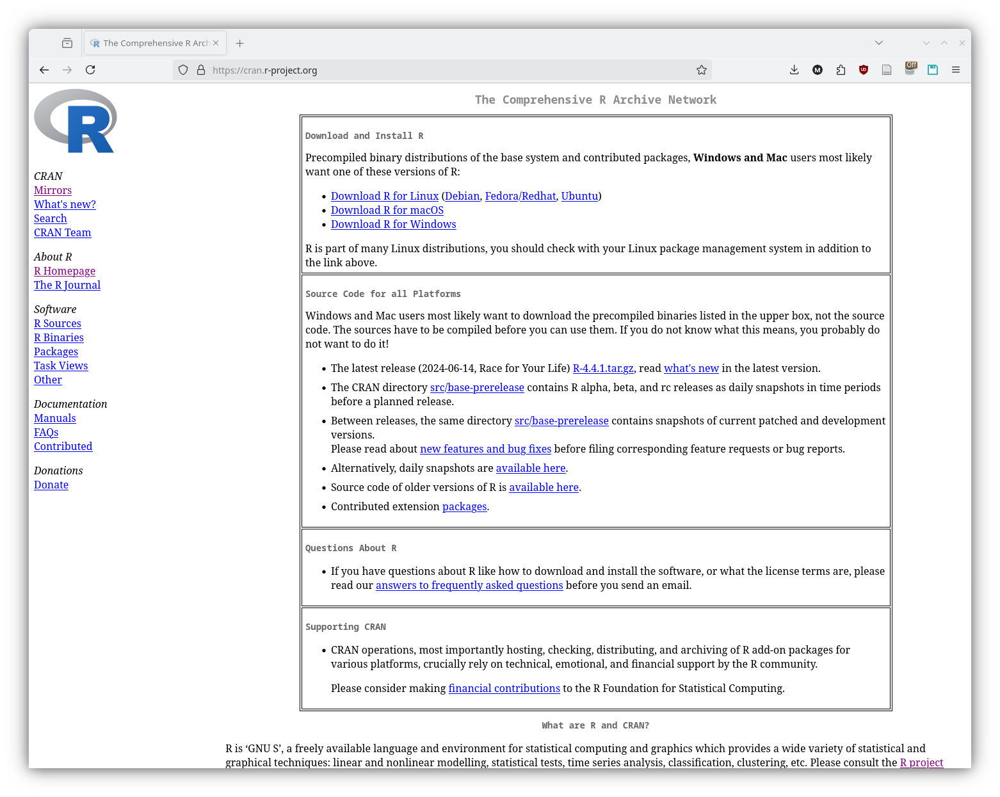
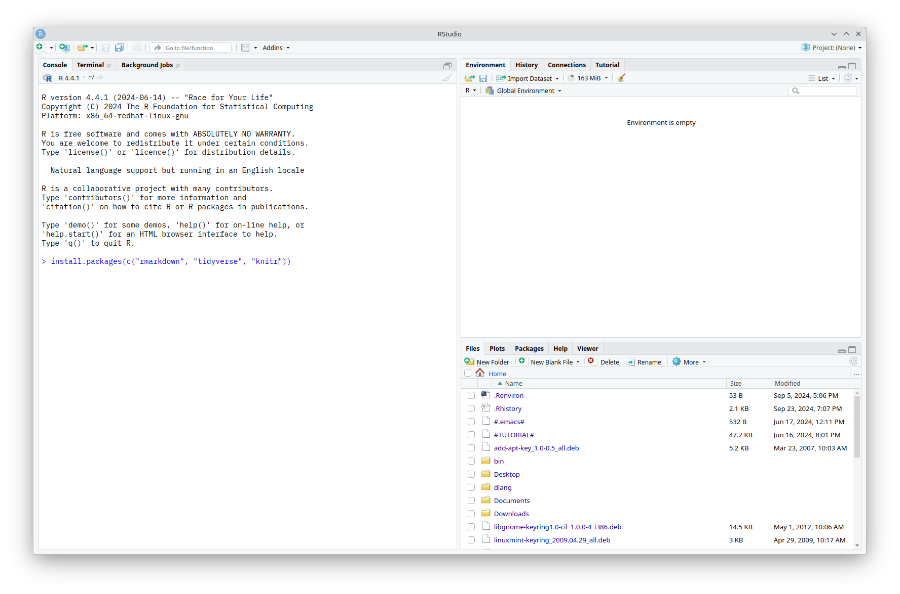
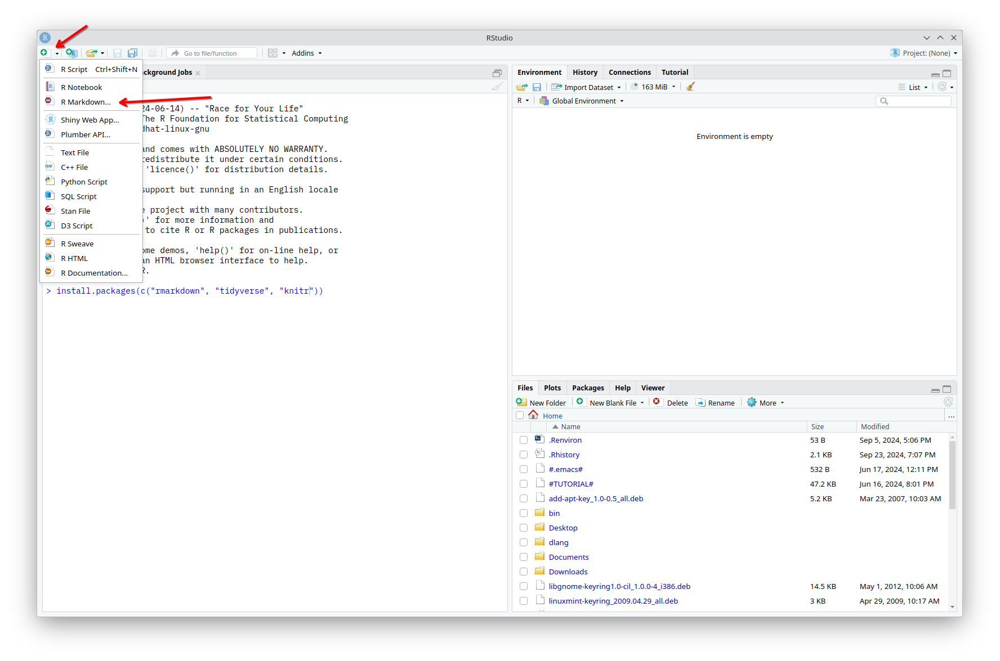
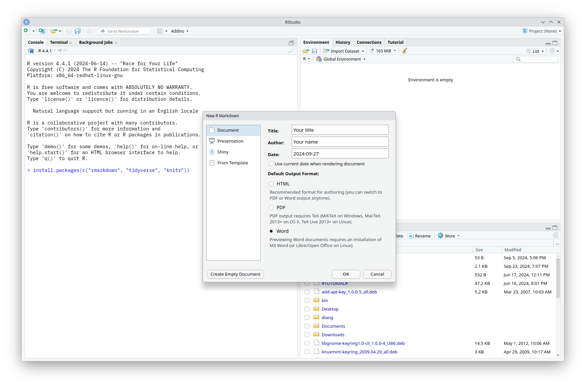
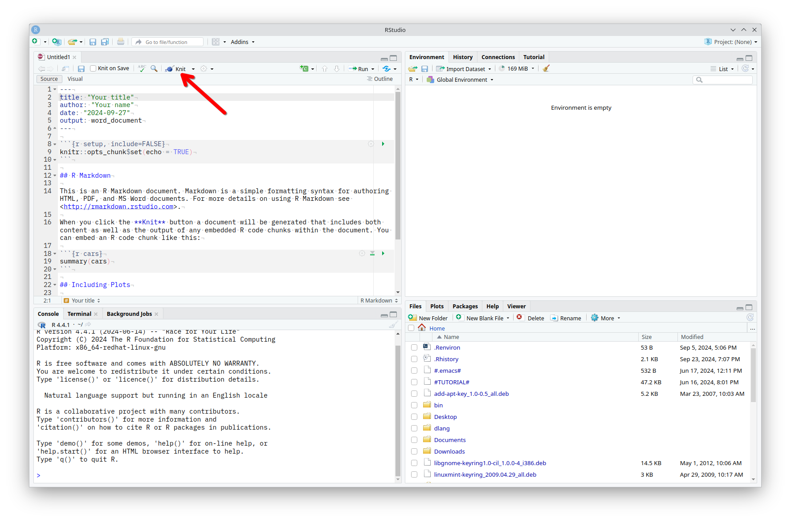

```{r setup, include=FALSE}
knitr::opts_chunk$set(echo = TRUE)
```

## 1. Download and Install R

Go to the CRAN R Project website <https://cran.r-project.org/>.



- **Windows**

  - Click on [Download R for Windows](https://cran.r-project.org/bin/windows/).
  - Choose [base](https://cran.r-project.org/bin/windows/base/) and then click on Download R 4.4.1 for Windows.
  - Once downloaded, open the installer and follow the prompts to complete the installation.
  
- **macOS**

  - Click on [Download R for macOS](https://cran.r-project.org/bin/macosx/).
  - Select the latest release for your version of macOS and download the installer.
  - Open the `.pkg` file and follow the installation instructions.

- **Linux**

  - Click on [Download R for Linux](https://cran.r-project.org/bin/linux/).
  - Choose your Linux distribution and follow the instructions on the page.

## 2. Download and Install RStudio

- Go to the RStudio website <https://posit.co/download/rstudio-desktop/>.
- Choose the appropriate version for your operating system (Windows, macOS, or Linux).
- Download and run the installer, then follow the instructions to install RStudio.

## 3. Open RStudio

- After installing both R and RStudio, open RStudio on your computer.

- Install the necessary packages by typing the following commands in the RStudio Console:

```{r eval=FALSE, echo=TRUE}
install.packages(c("rmarkdown", "tidyverse", "knitr"))
```



- Check Package Installation

  - Load each package with the `library()` function. Type in these functions one line at a time on the console and hit 'Enter' on your keyboard.

```{r eval=FALSE, echo=TRUE}
library(rmarkdown)
library(tidyverse)
library(knitr)

```

## Create an RMarkdown file

- Go to File > New File > RMarkdown... (or click the New file button on the upper right of the RStudio window).



- You will be presented with the following window.



  - Fill in the title of your document, your name and date.
  - Select 'Word' as the **Default Output Format**, as this will be the format used for the lab assignments.
  - Click 'OK'

- You don't have to worry about what is in this screen right now. Click the 'Knit' button on the top menu to create a Word document from this `.Rmd` file.

- If you haven't saved the `.Rmd` file yet, RStudio will first ask you to save this file in a folder of your choice.



- A new Word window should pop-up on your screen.
